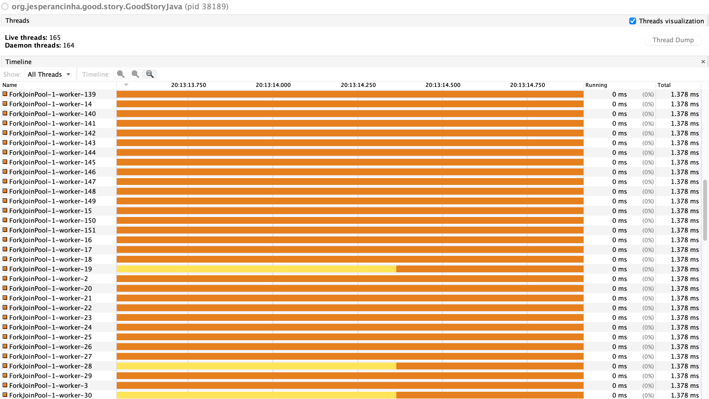
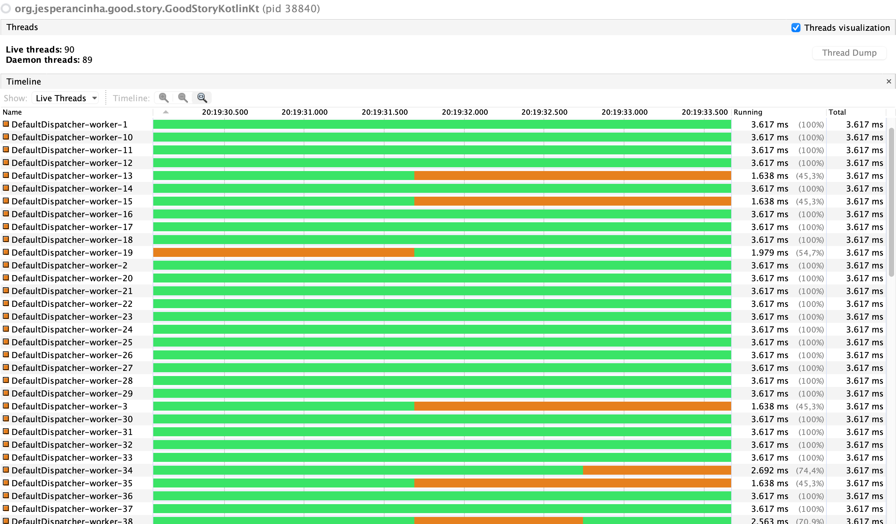
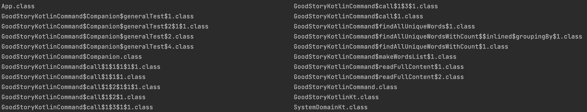
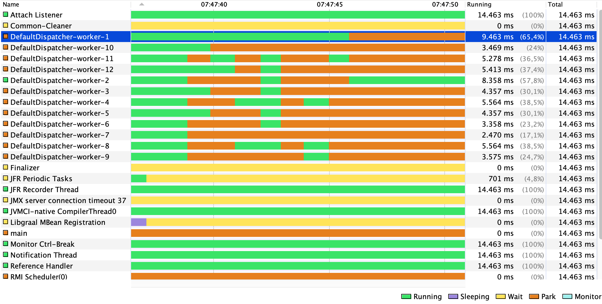
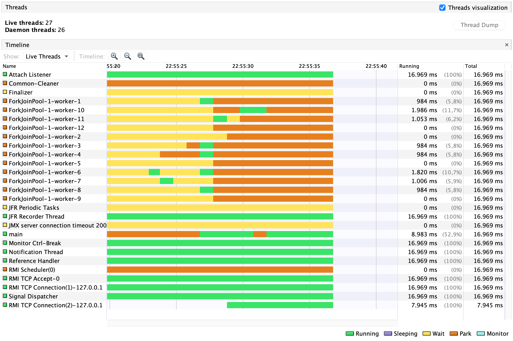

# Good Story Log Book

<ins>2022/05/23</ins>

Without the default dispatchers, we can actually get up to 64 dispatchers, apparently.
It seems that the name is actually the only difference in the end. `ForkJoinPool` for `Java` and `DefaultDispatcher` for `Kotlin`.
- Java



- Kotlin



<ins>2022/05/22</ins>

#### Knowledge at Risk

Knowledge at risk (This a list of identifiable things that `Kotlin` makes is seamlessly for us. Debatable if it is a good thing or not)

1. Order of variable assignment (pre-construct, during construct, `post-construct`, `pre-destroy`)
2. Autocloseable interfaces (a.k.a try with resources. In kotlin, this paradigm is reduced to `use`)
3. `Extends` vs `implements` (no longer available in kotlin and simply replaced withj `:` and the use of `()` in case of abstract classes)
4. Extension functions (They are not something new. Under the hood nothing has changed).
5. Differentiation between functional interfaces is completely gone in Kotlin (Underwater there are still Consumers, Suppliers, Operators and Functions, but the concept of `receivers` obliterated all of that)

All of the above is not necessary to learn in Kotlin. Or is it?

#### Impossible to compare

Comparing the behaviour of co-routines under GraalVM and Java virtual threads under JDK 19 has revealed to be impossible. During performance tests, it has been noticed that the FileOutputStream from Project Loom is quite different than its counterpart in GraalVM:

- Project Loom write method:

```java
public void write(byte[] b) throws IOException {
  boolean append = fdAccess.getAppend(fd);
  long comp = Blocker.begin();
  try {
      writeBytes(b, 0, b.length, append);
  } finally {
      Blocker.end(comp);
  }
}
```

- GraalVM write method:

```java
public void write(byte b[]) throws IOException {
  writeBytes(b, 0, b.length, fdAccess.getAppend(fd));
}
```

This has unknowingly affected all performance tests. Finding out why Project Loom uses a `Blocker` to write files, can be an interesting subject but its completely off topic. For this project, this is a problem because it slows down performance dramatically when testing repetitions.
This is why the coroutines project is being migrated to use Project Loom as JDK. It will be a strange mix, but its the only way to compare the behaviour of coroutines and the JDK19's virtual threads at this point.

<ins>2022/05/21</ins>

Nothing to do with this project but very cool that we can make math like this now:

**The Cauchy-Schwarz Inequality**

$$\left( \sum_{k=1}^n a_k b_k \right)^2 \leq \left( \sum_{k=1}^n a_k^2 \right) \left( \sum_{k=1}^n b_k^2 \right)$$

[Render mathematical expressions in Markdown](https://github.blog/changelog/2022-05-19-render-mathematical-expressions-in-markdown/)

<ins>2022/05/18</ins>

A bizarre world. If we use `Tools`->`Kotlin`->`Decompile to Java`, we get mega classes in Java that do not compile, have errors and are honestly not Java anyway. Or better yet, it is a Java version of the Kotlin classes who just had too much to drink.

The reality though, is that IntelliJ doesn't really let you see what is happening under the hood. What's really happening is that the Kotlin Compiler has created a bunch of classes:

```shell
ls kotlin-good-story/build/classes/kotlin/main/org/jesperancinha/kotlin/good/story 
```

This is where we can see all classes that have been created:



This IS the place where the actual Java Bytecode exists

<ins>2022/05/16</ins>

Using Visual VM, it is seen that only 12 Dispatchers are generated per Thread. Is this fixed? Why? What does it mean? Can it be higher? The dispatchers seem to match coroutines.



> 12 is the number of cores available. Coroutines make use of all available cores, as needed, in order to segment a system Thread into different separate suspended executions.

Look exactly the same as virtual threads! Except that in Java they are called workers of a ForkJoinPool:



Sounds like the same, only that workers seem to work much faster than coroutines. I guess because they work? And coroutines are like routines? Dunno, but something to investigate further.

<ins>2022/05/13</ins>

1. There is something different about `fun suspend main`. It reflects itself on the duration of coroutines. Figure it out!

> Nothing is wrong with it, actually. It's just that no clear exception is given in the logs. The latency for the next coroutine just gets longer and longer

<ins>2022/05/08</ins>

3. There seems to be an improvement in performance between Java Project Loom and Kotlin Coroutines. In a simple start and stop of processes to increase the value of an atomic integer, 10000000 Virtual Threads took 3 second to complete. The same number of their counterparts in kotlin coroutines took
   on average 6 seconds. It's too early to draw any conclusions, but the results match my expectations.

## TODO List

1. Parse .class generated files and make a text file with all the byte unrecognizable characters removed.